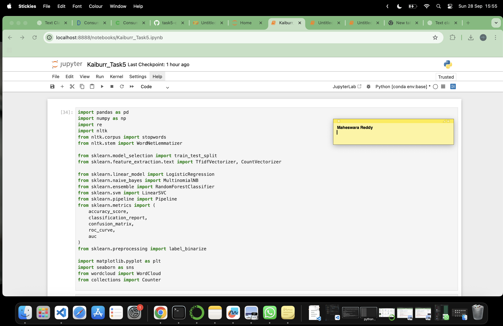

# 📚 Task 5: Consumer Complaint Text Classification (Kaiburr Assessment)

This repository contains the complete solution for the Kaiburr Assessment Data Science Task, which involves building a machine learning pipeline to classify consumer complaints.

## 🎯 Project Goal

The primary objective is to develop a **multi-class text classification model** capable of automatically assigning consumer complaint narratives to one of four predetermined financial product categories:

| Label (ID) | Category Name |
| :---: | :--- |
| **0** | Credit reporting, repair, or other |
| **1** | Debt collection |
| **2** | Consumer Loan |
| **3** | Mortgage |

***

## 🛠️ Methodology and Technologies

The solution implements a complete, structured NLP pipeline using Python and Scikit-learn, adhering to the required steps:

### Core Technologies
* **Language:** Python 3.x
* **Core Libraries:** Pandas, Scikit-learn, Matplotlib, Seaborn
* **NLP Tools:** NLTK (Stopword Removal, Lemmatization)
* **Model:** Logistic Regression (within a Scikit-learn Pipeline)

### Pipeline Steps

| Step | Focus | Description |
| :--- | :--- | :--- |
| **1. EDA & Feature Eng.** | Data Understanding | Load, filter, and drop duplicates. Visualizations include **Class Distribution** and **Text Length by Category**. |
| **2. Preprocessing** | Text Cleaning | Lowercasing, token removal (e.g., `XXXX`), Lemmatization, and Stopword removal. |
| **3. Modeling** | Feature Extraction | Text is transformed into numerical features using **TF-IDF Vectorization** (Term Frequency-Inverse Document Frequency). |
| **4. Training** | Model Training | A **Logistic Regression** classifier is trained on the vectorized data. |
| **5. Evaluation** | Performance Metrics | Output of **Accuracy**, **Classification Report** (P/R/F1-score), and **Confusion Matrix** visualization. |
| **6. Prediction** | Testing | Use the final model to predict the category for new, unseen complaint narratives. |

***

## 🚀 How to Run the Analysis

### Prerequisites
1.  **Python 3.8+** must be installed.
2.  **Dependencies:** Install all required libraries:
    ```bash
    pip install pandas numpy scikit-learn matplotlib seaborn nltk
    ```
3.  **Dataset:** The file **`consumer_complaints.csv`** must be downloaded from the public repository and placed in the project root directory.

### Execution

1.  Navigate to the repository folder in your terminal.
2.  Execute the main script:
    ```bash
    python your_task5_script_name.py
    ```

The script will handle the NLTK downloads automatically and then sequentially print the training progress, evaluation report, and final predictions to the console, while displaying three graphical visualizations.

***

## 🖼️ Required Screenshots

Per assessment requirements, the following screenshots demonstrating successful execution and meeting the image formatting rules are linked below.

**NOTE:** Ensure all screenshots contain a visible **date/time stamp** and your **name/username**.

### 1. Importing All Modules


### 1. Data Distribution Visualization (EDA)


### 2. Text Length Visualization (EDA)


### 3. Model Evaluation Report (Console Output)


### 4. Confusion Matrix (Evaluation Visualization)

